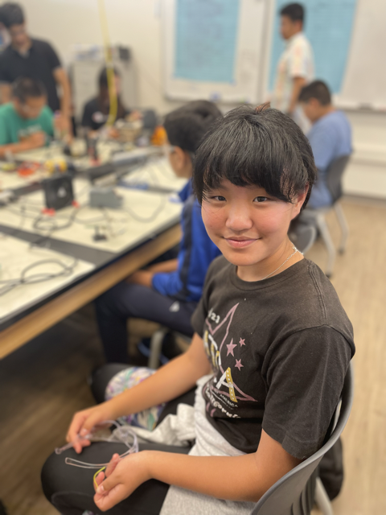
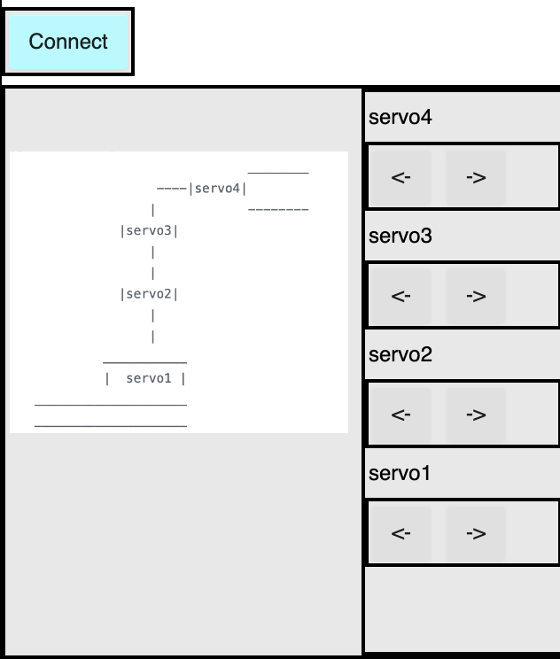
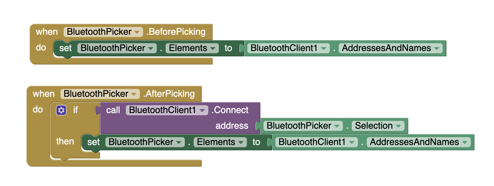
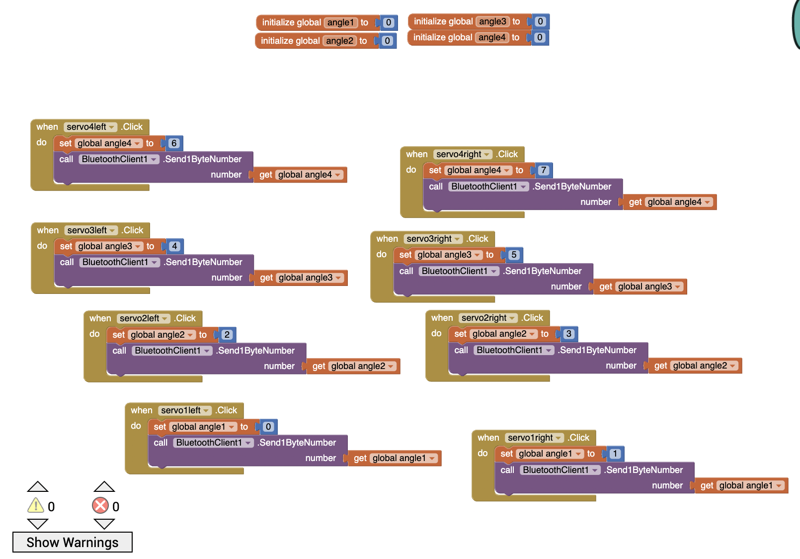
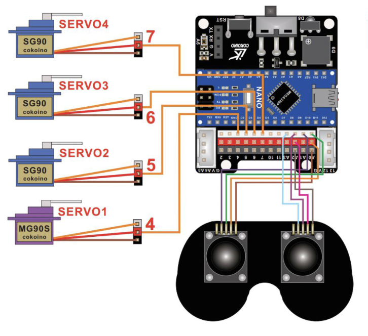

# Three Joint Arm
<!--- Replace this text with a brief description (2-3 sentences) of your project. This description should draw the reader in and make them interested in what you've built. You can include what the biggest challenges, takeaways, and triumphs from completing the project were. As you complete your portfolio, remember your audience is less familiar than you are with all that your project entails! -->
<!--- The three joint arm is a mechanical arm "connected" by servos and controlled using a joystick. -->

<!--- You should comment out all portions of your portfolio that you have not completed yet, as well as any instructions: -->

<!--- This is an HTML comment in Markdown -->
<!--- Anything between these symbols will not render on the published site -->


| **Engineer** | **School** | **Area of Interest** | **Grade** |
|:--:|:--:|:--:|:--:|
| Irene L | Stratford Preparatory Blackford | Electrical Engineering, Mechanical Engineering, and/or Computer Science | Rising/Incoming 7th

<!---**Replace the BlueStamp logo below with an image of yourself and your completed project. Follow the guide [here](https://tomcam.github.io/least-github-pages/adding-images-github-pages-site.html) if you need help.**-->


 
<!---copy image uploaded to gh part, not main; just put the name :) -->

## Overview
- Starter Project: RGB Slider Kit
- Milestone 1: Tested Joystick and Servos
- Milestone 2: Completed Assembly
- Milestone 3: Completed Programming
- Modification 1: Specific function
- Modification 2: Bluetooth Connection


## Modifications 

<iframe width="560" height="315" src="https://www.youtube.com/embed/hBoH1VHoqak?si=k8riJ60CTB0-GqFw" title="YouTube video player" frameborder="0" allow="accelerometer; autoplay; clipboard-write; encrypted-media; gyroscope; picture-in-picture; web-share" referrerpolicy="strict-origin-when-cross-origin" allowfullscreen></iframe>

### Modification 1

#### Progress
I used a button to set the claw to either 90 + current position or 0 degrees.

```c++
#include <Servo.h>
Servo servo;
int pos = 0;

int inpin = 10;

int q; 

void setup() {
  // put your setup code here, to run once:
  servo.attach(7);
  servo.write(0);
  pinMode(inpin, INPUT_PULLUP);
  Serial.begin(9600);
}

void loop() {
  // put your main code here, to run repeatedly:
  q = digitalRead(inpin);
  Serial.println(q);
  if (q == LOW) {
    pos = pos + 90;
    servo.write(pos);

    if (pos >= 160) {
       pos = 0;
       servo.write(pos);
    } 

    delay(700);

  }
}
```

#### Challenges
I had to use a breadboard because there were no buttons that could go directly on the pins available, and I was not particularly familiar with breadboards, but I figured out how it worked. 

#### Code 
Note: This is the final code for this modification, and it includes the previous code.

``` c++
#include <Servo.h>          

Servo servo1; //red        
Servo servo2; //red
Servo servo3; //blue
Servo servo4; //blue

int joystick_x = A0;                                                  
int joystick_y = A1;
int joystickblue_x = A2;
int joystickblue_y = A3;             

int pos_x;                 
int pos_y;  
int posblue_x;
int posblue_y;              

int pos1 = 0;        
int pos2 = 90;
int pos3 = 90;
int pos4 = 0;

int inpin = 10; //button
int q; //tracks high/low


void setup() {
  Serial.begin(9600);
  servo1.attach(4);          
  servo2.attach(5);
  servo3.attach(6);
  servo4.attach(7);

  servo1.write(pos1);           
  servo2.write(pos2);
  servo3.write(pos3);
  servo4.write(pos4);

  pinMode(joystick_x, INPUT);                     
  pinMode(joystick_y, INPUT);    
  pinMode(joystickblue_x, INPUT);
  pinMode(joystickblue_y, INPUT);     

  pinMode(inpin, INPUT_PULLUP);             
}

void loop () {
  q = digitalRead(inpin);
  Serial.println(q);

  if (q == LOW) {
    pos4 = pos4 + 90;
    servo4.write(pos4);

    if (pos4 >= 160) {
      pos4 = 0;
      servo4.write(pos4);
    }

    delay(700);
  }

  pos_x = analogRead(joystick_x);  
  pos_y = analogRead(joystick_y);  

  posblue_x = analogRead(joystickblue_x);
  posblue_y = analogRead(joystickblue_y);                 

  if (pos_x < 300) {      
    if (pos1 >= 10) {  
      pos1 = pos1 - 20;
      servo1.write (pos1);
      delay (50);
    }
  }

  if (pos_x > 700) {
    if (pos1 <= 180) {
      pos1 = pos1 + 20;
      servo1.write (pos1);
      delay(50);
    }
  }

    if (pos_y < 300) {      
    if (pos2 >= 10) {  
      pos2 = pos2 - 20;
      servo2.write (pos2);
      delay (50);
    }
  }

  if (pos_y > 700) {
    if (pos2 <= 180) {
      pos2 = pos2 + 20;
      servo2.write (pos2);
      delay(50);
    }
  }

  if (posblue_x < 300) {     
    if (pos3 >= 10) { 
      pos3 = pos3 - 20;
      servo3.write(pos3);
      delay(70);
    }
  }

  if (posblue_x > 700) {
    if (pos3 <= 180) {  
      pos3 = pos3 + 20;
      servo3.write(pos3);
      delay(70);
    }
  }

    if (posblue_y < 300) {     
    if (pos4 >= 10) { 
      pos4 = pos4 - 10;
      servo4.write(pos4);
      delay(70);
    }
  }

  if (posblue_y > 700) {
    if (pos4 <= 180) {  
      pos4 = pos4 + 10;
      servo4.write(pos4);
      delay(70);
    }
  }
}

```


### Modification 2

#### Progress
I used an HC-05 as a bluetooth module and created an app that controls the robotic arm.

#### App




The buttons send numbers to the Arduino, which processes the information, matches it to a servo, and has it run. "Servo1left" (the button taking in information for servo1 (in the Arduino code) sends 0, for example, and other buttons send different numbers. 

#### App Code



This above code lets the module connect to bluetooth. When the "connect" button is pressed, the available devices to connect will show up, and if connected will let the phone control the arm. 




This above code sends numbers to the Arduino. The number is stored in a variable (as seen in the code below), and depending on what the number stored in the variable is, the desired servo will move a specific increment (of 20 degrees or of 10 degrees, depending on which servo is being moved) in the desired direction. 


#### Challenges
At first, when I first started testing the bluetooth between the phone and HC-05, the connection broke within the first five seconds, but the arm was working pretty well, so even though my research said it was that the HC-05 wasn't getting enough power, I didn't measure the power the batteries were giving. Then when I tested it the next day (since when I encountered the problem it was very late and I had to troubleshoot the next day), I noticed that the arm was wrapping itself in its own wires, a behavior that I observed every time it wasn't getting enough power from the batteries. First I measured the power coming from each individual battery, and they were sending enough; then I measured whether or not power was going through the coils, and power was going through. Lastly I measured whether or not the plastic connector was receiving anything, and it wasn't receiving anything. I realized the solders were probably broken, even though earlier when I looked at it the solders looked fine. I still cut the wires where it was soldered and then resoldered the wires together, and the problem was solved. 


#### Final Code:

``` c++
#include <Servo.h> 
#include <SoftwareSerial.h>         

Servo servo1; //red        
Servo servo2; //red
Servo servo3; //blue
Servo servo4; //blue

int joystick_x = A0;                                                  
int joystick_y = A1;
int joystickblue_x = A2;
int joystickblue_y = A3;             

int pos_x;                 
int pos_y;  
int posblue_x;
int posblue_y;              

int pos1 = 90;        
int pos2 = 90;
int pos3 = 90;
int pos4 = 0;

int inpin = 10; //button
int q; //tracks high/low

//int state = 0; 

#define rxPin 3
#define txPin 2

SoftwareSerial BTSerial(rxPin, txPin); 

void setup() {
  Serial.begin(9600);
  servo1.attach(4);          
  servo2.attach(5);
  servo3.attach(6);
  servo4.attach(7);

  servo1.write(pos1);           
  servo2.write(pos2);
  servo3.write(pos3);
  servo4.write(pos4);

  pinMode(joystick_x, INPUT);                     
  pinMode(joystick_y, INPUT);    
  pinMode(joystickblue_x, INPUT);
  pinMode(joystickblue_y, INPUT);     

  pinMode(inpin, INPUT_PULLUP); 

  pinMode(rxPin, INPUT);
  pinMode (txPin, OUTPUT);

  BTSerial.begin(9600);            
}

void loop () {
  q = digitalRead(inpin);
  //Serial.println("value: ");
  //Serial.print(q);

  if (q == LOW) {
    pos4 = pos4 + 90;
    servo4.write(pos4);
    Serial.println("low");

    if (pos4 >= 160) {
      pos4 = 0;
      servo4.write(pos4);
    } 

    delay(700);
  } 
  

  /*
  if(BTSerial.available() > 0){ // Checks whether data is comming from the serial port
      state = BTSerial.read(); // Reads the data from the serial por
  }
  */
  while (BTSerial.available() > 0) {
    int move = BTSerial.read(); // is the variable for what is coming through

    if(move == 0) { // Checks whether data is comming from the serial port
      if (pos1 > 20) {
        pos1 -= 20;
      }
      else {
        pos1 = 0;
      }
      //pos1 = pos1 - 20;
      servo1.write(pos1);
      Serial.println(move);
    }

    if(move == 1) { // Checks whether data is comming from the serial port
      if (pos1 < 160) {
        pos1 += 20;
      }
      else {
        pos1 = 180;
      }
      //pos1 = pos1 + 20;
      servo1.write(pos1);
      Serial.println(move);
    }

    if(move == 2) { // Checks whether data is comming from the serial port
      //pos2 = pos2 + 20;
      if (pos2 < 160) {
        pos2 += 20;
      }
      else {
        pos2 = 180;
      }
      servo2.write(pos2);
      Serial.println(move);
    }
    
    if(move == 3) { // Checks whether data is comming from the serial port
      //pos2 = pos2 + 20;
      if (pos2 > 20) {
        pos2 -= 20;
      }
      else {
        pos2 = 0;
      }
      servo2.write(pos2);
      Serial.println(move);
    }

    if(move == 4) { // Checks whether data is comming from the serial port
      //pos3 = pos3 + 20;
      if (pos3 < 160) {
        pos3 += 20;
      }
      else {
        pos3 = 180;
      }
      servo3.write(pos3);
      Serial.println(move);
    }

    if(move == 5) { // Checks whether data is comming from the serial port
      //pos3 = pos3 - 20;
      if (pos3 > 20) {
        pos3 -= 20;
      }
      else {
        pos3 = 0;
      }
      servo3.write(pos3);
      Serial.println(move);
    }

    if(move == 6) { // Checks whether data is comming from the serial port
      //pos4 = pos4 + 10;
      if (pos4 < 170) {
        pos4 += 10;
      }
      else {
        pos4 = 180;
      }
      servo4.write(pos4);
      Serial.println(move);
    }

    if(move == 7) { // Checks whether data is comming from the serial port
      //pos4 = pos4 - 10;
      if (pos4 > 10) {
        pos4 -= 10;
      }
      else {
        pos4 = 0;
      }
      servo4.write(pos4);
      Serial.println(move);
    }
  }
 
}

```

### Challenges
  A challenge that I faced while doing these modifications was the consistently disconnecting HC-05 bluetooth module. I went back and tested the arm again and then found out that the arm wasn't doing very well--and that it was only acting like that when the batteries were not giving power. After measuring with a multimeter, I found that most batteries had enough (around 1.5 or 1.6 V), but the connector was not receiving anything. I resoldered the wires, measured, and after reconnection found that the HC-05 was not randomly disconnecting anymore. 

  


## Final Milestone

<iframe width="560" height="315" src="https://www.youtube.com/embed/c7WFhJLDVuY?si=f4WyBtUir1y9YiWi" title="YouTube video player" frameborder="0" allow="accelerometer; autoplay; clipboard-write; encrypted-media; gyroscope; picture-in-picture; web-share" referrerpolicy="strict-origin-when-cross-origin" allowfullscreen></iframe>

### Progress
For my third (and final) milestone, I have programmed the robot and added electrical tape on the servos. 

### Challenges and Triumphs
  My most prominent challenge at BSE are probably dealing with the arm's erratic movement during testing--the arm would sometimes accelerate much faster than initially planned, and it would pull at the wires of the servos until the servo's wire...broke. I did not account for that initially, and when the program started the joints would move around mindlessly until it reached 90 degrees, and an increment of 20 each turn was a bit large. 

  Great...triumphs...at BSE so far are probably finally getting the servo to work after restarting the Arduino, finishing the assembly, and then finishing the coding.

### What I learned
  At BSE, I learned a lot about mechanical engineering and some about software, as well as about how to solder and use breadboards (for my first modification). I also learned about Arduino's built-in resistor (that isn't triggered unless the command "PULLUP" is used after "INPUT" and other commands that were necessary to make my project. I probably also learned (or at least practiced) to focus for longer periods of time and to commit to a single project without hesitating for hours. 

### In the future
  In the future, I hope to engage in the process of other projects that require as much--if not more--commitment and focus, as well as learning more about engineering in general. I hope to gain engineering skills from experience and expertise, and career-wise--hopefully the above will help create a path for such a future. 

<!--- For your final milestone, explain the outcome of your project. Key details to include are:
- What you've accomplished since your previous milestone
- What your biggest challenges and triumphs were at BSE
- A summary of key topics you learned about
- What you hope to learn in the future after everything you've learned at BSE -->

### Code
```c++
#include <Servo.h>          

Servo servo1; //red        
Servo servo2; //red
Servo servo3; //blue
Servo servo4; //blue

int joystick_x = A0;                                                  
int joystick_y = A1;
int joystickblue_x = A2;
int joystickblue_y = A3;             

int pos_x;                 
int pos_y;  
int posblue_x;
int posblue_y;              

int pos1 = 90;        
int pos2 = 90;
int pos3 = 90;
int pos4 = 90;


void setup() {
  Serial.begin(9600);
  servo1.attach(4);          
  servo2.attach(5);
  servo3.attach(6);
  servo4.attach(7);

  servo1.write(pos1);           
  servo2.write(pos2);
  servo3.write(pos3);
  servo4.write(pos4);

  pinMode(joystick_x, INPUT);                     
  pinMode(joystick_y, INPUT);    
  pinMode(joystickblue_x, INPUT);
  pinMode(joystickblue_y, INPUT);                  
}

void loop () {
  pos_x = analogRead(joystick_x);  
  pos_y = analogRead(joystick_y);  

  posblue_x = analogRead(joystickblue_x);
  posblue_y = analogRead(joystickblue_y);                 

  if (pos_x < 300) {      
    if (pos1 >= 10) {  
      pos1 = pos1 - 20;
      servo1.write (pos1);
      delay (50);
    }
  }

  if (pos_x > 700) {
    if (pos1 <= 180) {
      pos1 = pos1 + 20;
      servo1.write (pos1);
      delay(50);
    }
  }

    if (pos_y < 300) {      
    if (pos2 >= 10) {  
      pos2 = pos2 - 20;
      servo2.write (pos2);
      delay (50);
    }
  }

  if (pos_y > 700) {
    if (pos2 <= 180) {
      pos2 = pos2 + 20;
      servo2.write (pos2);
      delay(50);
    }
  }

  if (posblue_x < 300) {     
    if (pos3 >= 10) { 
      pos3 = pos3 - 20;
      servo3.write(pos3);
      delay(70);
    }
  }

  if (posblue_x > 700) {
    if (pos3 <= 180) {  
      pos3 = pos3 + 20;
      servo3.write(pos3);
      delay(70);
    }
  }

    if (posblue_y < 300) {     
    if (pos4 >= 10) { 
      pos4 = pos4 - 10;
      servo4.write(pos4);
      delay(70);
    }
  }

  if (posblue_y > 700) {
    if (pos4 <= 180) {  
      pos4 = pos4 + 10;
      servo4.write(pos4);
      delay(70);
    }
  }
}

```

## Second Milestone

<iframe width="560" height="315" src="https://www.youtube.com/embed/6ezD6wMuPNM?si=VSegnzb60y6GBvxW" title="YouTube video player" frameborder="0" allow="accelerometer; autoplay; clipboard-write; encrypted-media; gyroscope; picture-in-picture; web-share" referrerpolicy="strict-origin-when-cross-origin" allowfullscreen></iframe>


### Progress

From the first to the second milestone, I have finished the assembly of the three joint arm. I used the code from last milestone to test the servos. 

#### Schematics



### Challenges

A challenge was that the screw that was in the base (continuous) servo was too short, and it had only a few threads inside the servo, so the servo underrotated every time it was supposed to move to 180 degrees when I was testing. Initially I thought it was too short, but I asked around and people said it was fine, so I screwed it in and it miraculously fit. However, that did become a problem. I replaced it with a longer screw, and it started workign correctly.

<!--- 

For your second milestone, explain what you've worked on since your previous milestone. You can highlight:
- Technical details of what you've accomplished and how they contribute to the final goal
- What has been surprising about the project so far
- Previous challenges you faced that you overcame
- What needs to be completed before your final milestone -->

## First Milestone

**The thumbnail is slightly interesting**

<iframe width="560" height="315" src="https://www.youtube.com/embed/tGmL5t1myjA?si=I-FYEx09ZaVeYxXU" title="YouTube video player" frameborder="0" allow="accelerometer; autoplay; clipboard-write; encrypted-media; gyroscope; picture-in-picture; web-share" referrerpolicy="strict-origin-when-cross-origin" allowfullscreen></iframe>

<!--- For your first milestone, describe what your project is and how you plan to build it. You can include:
- An explanation about the different components of your project and how they will all integrate together
- Technical progress you've made so far
- Challenges you're facing and solving in your future milestones
- What your plan is to complete your project -->


### Progress

The first milestone was to have the joystick's movement control the servo's movement. The joystick's x-axis (in this case) can be read from pin A0, and the "signal" is sent to the servo, which is connected, with a data wire, to pin 7. In this code, if the "x value" (position of the joystick) is greater than 600, then the servo will go to 180 degrees, and if it is less than 300 the servo will go to zero degrees (it is set to 0 degrees at the start in void setup). I also printed the x-axis position of the joystick in the Serial monitor to track the movement and for troubleshooting purposes. 

### Challenges

1. The servos that I was using weren't really working initially with a test code that was moving the servo to 90 degrees and it moved about 10 degrees. I restarted the Arduino a few times and then it started working; it could be a software issue that fixed itself, and I need to monitor it in the future.
    
2. The delays in my starting code froze the Serial monitor--it would send approximately three values and then freeze for about thirty seconds, then send three more very slowly. I shortened delays about 50 ms (instead of 100 ms). This problem can carry onto the third milestone, as making the servo turn a certain degree is more difficult with less control. 

Afterwards I should be able to continue with assembling the three joint arm and then coding all four servos. 

<!--- # Schematics 
Here's where you'll put images of your schematics. [Tinkercad](https://www.tinkercad.com/blog/official-guide-to-tinkercad-circuits) and [Fritzing](https://fritzing.org/learning/) are both great resoruces to create professional schematic diagrams, though BSE recommends Tinkercad becuase it can be done easily and for free in the browser, couldn't go into schematic diagrams, will do this later -->

### Code
<!--- Here's where you'll put your code. The syntax below places it into a block of code. Follow the guide [here]([url](https://www.markdownguide.org/extended-syntax/)) to learn how to customize it to your project needs. -->

```c++
#include "Servo.h"
Servo servo_one;
int pos = 0;
  

void setup() {


  servo_one.attach(7); //in case I need another servo


  Serial.begin(9600);
  servo_one.write(0);

}

void loop() {
  // put your main code here, to run repeatedly:  
  int xvalue = analogRead(A0); //joystick
  Serial.println(xvalue);
  
  
  if (xvalue > 600) {
    pos = 180;
    servo_one.write(pos);
   
    delay(50);
  }

  if (xvalue < 300) {
    pos = 0;
    servo_one.write(pos);

  
    delay(50);
  }
  
}

```
## Bill of Materials
<!--- Here's where you'll list the parts in your project. To add more rows, just copy and paste the example rows below.
Don't forget to place the link of where to buy each component inside the quotation marks in the corresponding row after href =. Follow the guide [here]([url](https://www.markdownguide.org/extended-syntax/)) to learn how to customize this to your project needs. -->

| **Part** | **Note** | **Price** | **Link** |
|:--:|:--:|:--:|:--:|
| Arduino Nano | Runs the project | $24.90 | <a href="https://store.arduino.cc/products/arduino-nano"> Link </a> |
| LK Cokoino Robot Arm for Arduino | Project materials| $49.99 | <a href="https://www.amazon.com/LK-COKOINO-Compliment-Engineering-Technology/dp/B081FG1JQ1"> Link </a> |
| [5] AA Batteries | Powers the project | depends on the number | <a href="https://www.amazon.com/Best-Sellers-AA-Batteries/zgbs/hpc/389577011"> Link </a> |
| 5 x 1.5V AA Battery Holder| Holds the battery | $1.62 | <a href="https://www.amazon.com/Battery-Holder-Storage-Boxes-Black/dp/B07KNT1TH4"> Link </a> |
| HC-05 bluetooth module | Bluetooth module | $9.99 | <a href="https://www.amazon.com/DSD-TECH-HC-05-Pass-through-Communication/dp/B01G9KSAF6/ref=pd_lpo_sccl_1/142-5829447-2312401?pd_rd_w=qDMl6&content-id=amzn1.sym.4c8c52db-06f8-4e42-8e56-912796f2ea6c&pf_rd_p=4c8c52db-06f8-4e42-8e56-912796f2ea6c&pf_rd_r=YSHB0HD1HVSMWPN5AVHS&pd_rd_wg=QR2Do&pd_rd_r=8cebe64a-0d65-4b9e-a195-f79c015bee72&pd_rd_i=B01G9KSAF6&psc=1"> Link </a> |
| Button | Sets the top servo to 90 or 0 degrees | $4.99 for 100 | <a href="https://www.amazon.com/DAOKI-Miniature-Momentary-Tactile-Quality/dp/B01CGMP9GY?source=ps-sl-shoppingads-lpcontext&ref_=fplfs&smid=A30Y6WWS77DGEW&th=1"> Link </a> 
| Female to female, male to female wires, male to male wires | Connection | $5.38 for 120 (40 each) | <a href="https://www.amazon.com/Elegoo-EL-CP-004-Multicolored-Breadboard-arduino/dp/B01EV70C78/ref=pd_lpo_sccl_2/142-5829447-2312401?pd_rd_w=nwQwG&content-id=amzn1.sym.4c8c52db-06f8-4e42-8e56-912796f2ea6c&pf_rd_p=4c8c52db-06f8-4e42-8e56-912796f2ea6c&pf_rd_r=0JC8VP7D36ANZKTY218Y&pd_rd_wg=RmX27&pd_rd_r=692d8d0f-a2dd-42cd-813e-e1e3c4d4b757&pd_rd_i=B01EV70C78&psc=1"> Link </a> 


## Starter Project: RGB LED Slider kit
<iframe width="560" height="315" src="https://www.youtube.com/embed/qZ0iKe8ecOE?si=rf3ahFnXm_ps0_Ei" title="YouTube video player" frameborder="0" allow="accelerometer; autoplay; clipboard-write; encrypted-media; gyroscope; picture-in-picture; web-share" referrerpolicy="strict-origin-when-cross-origin" allowfullscreen></iframe>

The RGB LED kit uses three sliders, or linear potentiometers, to control the intensity and color of the LED. Linear potentiometers control resistance through linear motion, and there are essentially three smaller LEDs in a dome. Each slider/potentiometer sends voltage to the LED/LEDs, and this causes different brightness and colors. This RGB LED kit is essentially soldering practice, and the person soldering can be burnt because metal conducts heat quite well (and the sliders are metal), however this can be resolved by using something to prop it up. 

<!---elaborate-->


# Other Resources/Examples
- [Example 1](https://circuitdigest.com/microcontroller-projects/controlling-multiple-servo-motors-with-arduino)

